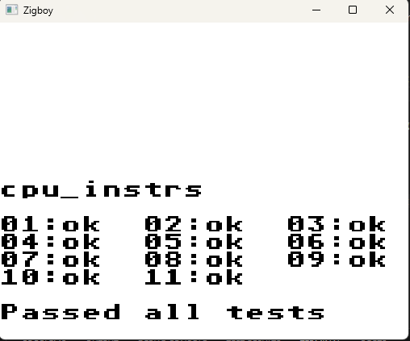
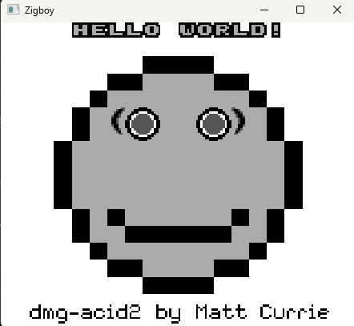
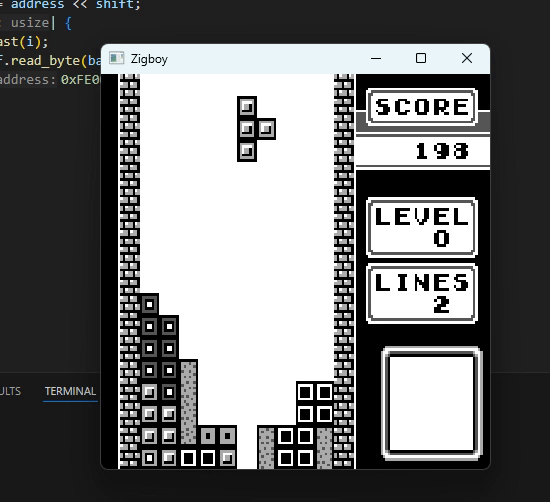
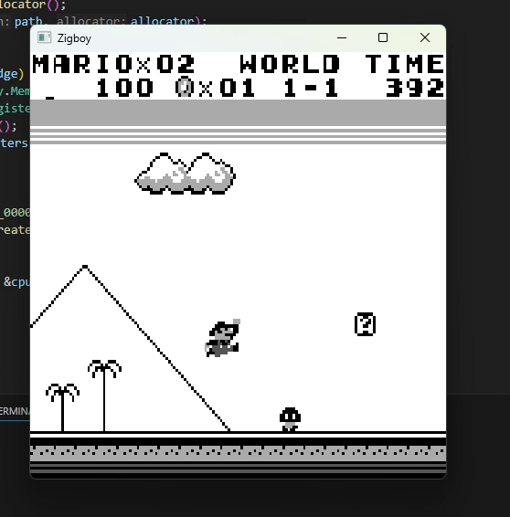
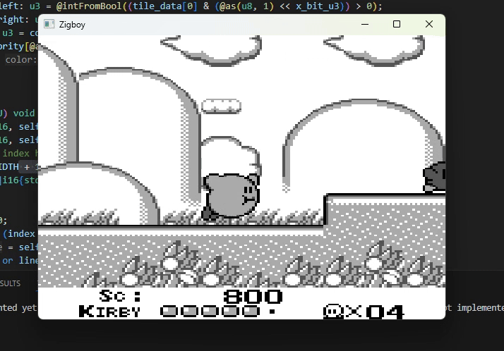

# Zigboy

A gameboy emulator written in zig 0.14 I made to learn zig programming. It passes all blargg cpu tests and dmg-acid2 test, but lacks audio. I only tested it with a few games.

## Screenshots
 | 
 | 
 | 

## How to run
Download the repo and update the path in the `open_catridge` function in main. It requires the full path.

## Keybindings

- <kbd>A</kbd> - 'A' button
- <kbd>S</kbd> - 'B' button
- <kbd>Enter</kbd> - 'start' button
- <kbd>Space</kbd> - 'select' button
- <kbd>&#8592;</kbd> - DPad left
- <kbd>&#8593;</kbd> - DPad up
- <kbd>&#8594;</kbd> - DPad right
- <kbd>&#8595;</kbd> - DPad down
